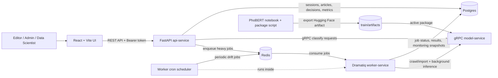

# VNN ML News Classification App

This monorepo is split into service-oriented modules:

- `ui/`: React + Vite UI following the Figma design file.
- `api-service/`: FastAPI BFF for editor, admin, and data-scientist workflows.
- `model-service/`: gRPC service that hosts PhoBERT inference.
- `worker-service/`: Dramatiq worker for long-running crawl, inference, and monitoring jobs.
- `train/`: PhoBERT Colab notebook, artifact packaging scripts, and model packages under `train/artifacts/`.
- `dataset/`: ignored local/raw VietNamNet URL lists and materialized parquet files, mirrored at `dathuynh1108/vietnamnet-news` on Hugging Face.

## Current Runtime Status

- The UI implements the main Figma screens as a local React app.
- The API exposes the editor, admin, monitoring, model-version, and dataset-lab routes needed by the UI.
- Product state is stored in relational Postgres tables for users, sessions, articles, predictions, decisions, thresholds, audit events, model runs, and dataset samples.
- Long-running article import and monitoring recompute work is queued through Redis and processed by Dramatiq.
- Inference is real when `model-service` can load an exported PhoBERT artifact from `train/artifacts/active/`.
- `model-service` requires a real exported PhoBERT/Hugging Face artifact; it fails fast when no artifact is available.

## System Architecture



Mutable application state is persisted in Postgres:

- authenticated user sessions
- threshold bands
- article decisions and latest review history
- active model package metadata
- audit log updates
- worker job status, results, and failures

## Proto ownership

`classifier.proto` lives in `model-service/proto/` because `model-service` owns the inference contract.

When the proto changes, run:

```bash
./model-service/scripts/generate_proto.sh
```

The script will:

1. Generate `model-service/app/generated/classifier_pb2.py`.
2. Copy the generated file to `api-service/app/generated/classifier_pb2.py`.
3. Normalize the generated file to avoid runtime-version guards from the local `protoc`.

## Start Locally

### 1. Start `model-service`

```bash
cd model-service
python3 -m venv .venv
source .venv/bin/activate
pip install -r requirements.txt
python -m app.main
```

The default artifact directory is:

```text
train/artifacts/active/
```

`model-service/requirements.txt` is the unified requirements file for the service and includes the PhoBERT inference dependencies. The service does not use a keyword or dummy classifier; create a real artifact before starting inference.

### 2. Start `postgres`

```bash
docker run --name vnn-postgres \
  -e POSTGRES_DB=vnn_ml \
  -e POSTGRES_USER=vnn \
  -e POSTGRES_PASSWORD=vnn \
  -p 5432:5432 \
  -d postgres:16-alpine
```

### 3. Start `redis`

```bash
docker run --name vnn-redis \
  -p 6379:6379 \
  -d redis:7-alpine
```

### 4. Start `api-service`

```bash
cd api-service
python3 -m venv .venv
source .venv/bin/activate
pip install -r requirements.txt
uvicorn app.main:app --reload --host 0.0.0.0 --port 8000
```

To override the gRPC or database connection:

```bash
export VNN_AI_SERVICE_HOST=127.0.0.1
export VNN_AI_SERVICE_PORT=50051
export VNN_DB_HOST=127.0.0.1
export VNN_DB_PORT=5432
export VNN_DB_NAME=vnn_ml
export VNN_DB_USER=vnn
export VNN_DB_PASSWORD=vnn
export VNN_REDIS_URL=redis://127.0.0.1:6379/0
```

### 5. Start `worker-service`

```bash
cd worker-service
python3 -m venv .venv
source .venv/bin/activate
pip install -r requirements.txt
cd ..
VNN_REDIS_URL=redis://127.0.0.1:6379/0 \
VNN_ENABLE_WORKER_SCHEDULER=true \
PYTHONPATH=api-service \
dramatiq app.jobs.worker -p1 -t4
```

`worker-service` has two job styles:

- on-demand jobs enqueued by API actions, such as article import and monitoring recompute
- cron jobs started by the worker scheduler, currently used for periodic drift monitoring snapshots

### 6. Start `ui`

```bash
cd ui
npm install
npm run dev -- --host 0.0.0.0
```

By default, the UI calls:

```text
http://localhost:8000/api
```

To override it:

```bash
export VITE_API_BASE_URL=http://localhost:8000/api
```

Default bootstrap accounts use the password `vnn-password`:

- `editor@vnn-lab.edu.vn`
- `admin@vnn-lab.edu.vn`
- `scientist@vnn-lab.edu.vn`

## Docker Compose

Before starting the full stack, create or upload a real model artifact into:

```text
train/artifacts/active/
```

The model service intentionally exits when that directory does not contain a loadable PhoBERT/Hugging Face package.

Build and run the full stack:

```bash
docker compose up --build
```

Stop the stack:

```bash
docker compose down
```

Endpoints:

- UI: `http://localhost:5173`
- API: `http://localhost:8000/api/health`
- Redis: `localhost:6379`
- gRPC model service: `localhost:50051`

## Implemented Workflows

- Auth: login, role-guarded API routes, Bearer sessions, and logout.
- Editorial queue: article import from URL or pasted content, inference, review, approve, override, and escalate.
- Worker jobs: async article import, async monitoring recompute, persisted job status, and cron-based drift snapshots.
- Admin operations: invite users, update routing thresholds, promote a model package, and inspect audit/deployment state.
- Model versions: upload artifact files, list packages, activate a run, copy its files to the active artifact directory, and download exports.
- Monitoring and Dataset Lab: recompute monitoring snapshots from stored articles, predictions, decisions, model runs, and dataset samples.
- Health: checks both Postgres and the gRPC model service.

## Train flow

1. Open `train/notebooks/main_PhoBERT.ipynb` in Colab.
2. Run all cells. The notebook downloads `dathuynh1108/vietnamnet-news` from Hugging Face when `/content/dataset` is empty, or materializes parquet files from `dataset/data_URLs.json` when provided.
3. Train the model.
4. Package the output:

```bash
python train/scripts/package_run.py \
  --model-dir train/runs/model \
  --output-dir train/artifacts/active
```

## Notes

- `api-service` creates relational tables and loads bootstrap records when the database is empty.
- If no real artifact exists in `train/artifacts/active/`, `model-service` exits instead of serving synthetic predictions.
- If the proto changes, commit both generated files in `model-service/app/generated/` and `api-service/app/generated/`.
