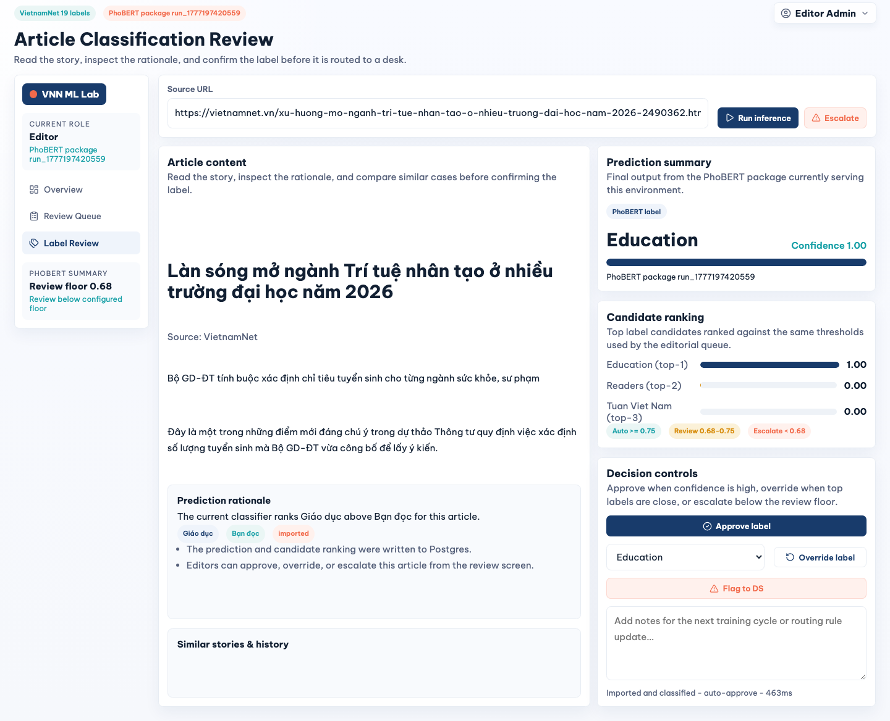
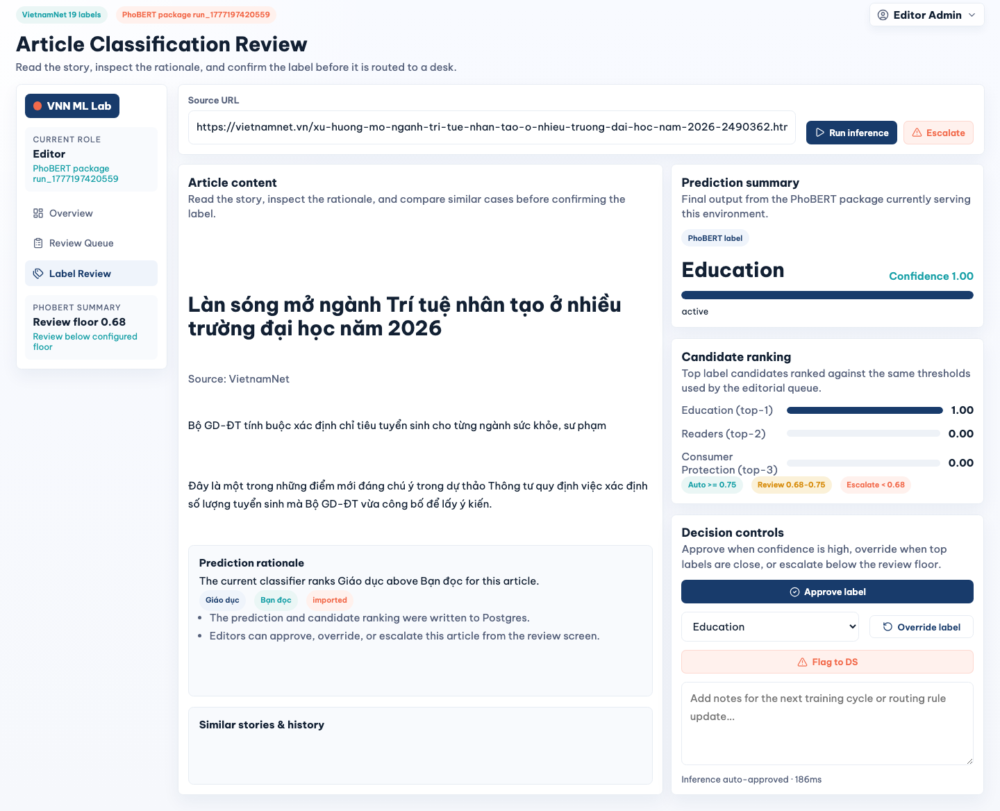

# Prompt ghép phần kiểm thử Playwright vào report - bản full VietnamNet thật

> Cập nhật mới: bản này dùng bộ ảnh `test-report-assets-full/`, có trang bài báo VietnamNet thật, flow import bằng URL thật, và màn hình đầy đủ cho Editor/Admin/Data Scientist.

Bạn hãy biên tập và ghép phần dưới đây vào báo cáo "Hệ thống phân loại và kiểm duyệt tin tức tiếng Việt sử dụng PhoBERT". Phong cách trình bày nên giống phần use case/demo trong Book4: có bảng kịch bản, luồng chính, kết quả quan sát và hình minh chứng.

## Vị trí cần sửa trong report

1. Giữ nguyên mục `5.3 Kế hoạch kiểm thử`, nhưng bổ sung tiểu mục `5.3.1 Kết quả kiểm thử end-to-end bằng Playwright`.
2. Thêm một tiểu mục nhỏ `5.3.2 Danh mục màn hình kiểm thử theo vai trò` nếu muốn liệt kê đủ screenshot cho 3 role.
3. Thêm các hình minh chứng vào `Danh sách hình vẽ` với caption ngắn, dạng `Hình 5.x`.
4. Trong phần kết luận, thêm một câu rằng hệ thống đã được kiểm thử qua UI với model-service thật, worker job thật, Postgres/Redis thật và artifact PhoBERT active.
5. Không khẳng định các negative test như model-service mất artifact, Redis tắt, upload thiếu file đã pass nếu chưa chạy riêng. Có thể ghi các case đó là kế hoạch kiểm thử bổ sung.

## Thông tin lần chạy kiểm thử

- Thời điểm capture: 15/05/2026 khoảng 23:30 ICT.
- Công cụ: Playwright Chromium. Có dùng cả batch Playwright script và MCP Playwright/browser để mở kiểm tra trực quan.
- Runtime thật: React/Vite UI, FastAPI API-service, Dramatiq worker, Redis, Postgres, gRPC model-service.
- Artifact active: `PhoBERT package run_1777197420559`.
- Metric artifact đọc từ package: macro-F1 `0.9016`, weighted-F1 `0.9085`, accuracy `0.9086`.
- Health check: database `ok`, model_service `ok`, model_version `active`, latency khoảng `448-693ms`.
- Bài báo thật lấy từ VietnamNet: `Làn sóng mở ngành Trí tuệ nhân tạo ở nhiều trường đại học năm 2026`.
- URL bài báo: `https://vietnamnet.vn/xu-huong-mo-nganh-tri-tue-nhan-tao-o-nhieu-truong-dai-hoc-nam-2026-2490362.html`.
- Bài test được import vào hệ thống: `art-1778862824-d6e1a1`.
- Kết quả inference thật trên màn hình review: nhãn `Giáo dục / Education`, confidence `1.00`, top candidates gồm `Education`, `Readers`, `Consumer Protection`, latency rerun `186ms`.
- Worker job import: `job-1778862823-03d9498a`, status `completed`.
- Worker job monitoring recompute: `job-1778862834-957ed2eb`, status `completed`, snapshot `#2`.

## Độ phủ màn hình theo 3 role

### Nguồn dữ liệu và health

| Màn hình | Mục đích | Minh chứng |
|---|---|---|
| API health | Xác nhận database và model-service đang chạy thật trước khi test UI. | `test-report-assets-full/00-api-health-model-service.png` |
| Trang bài báo VietnamNet | Chứng minh dữ liệu import đến từ bài báo thật, không phải input tự chế. | `test-report-assets-full/01-source-vietnamnet-article.png`, `test-report-assets-full/mcp-source-vietnamnet-visible.png` |

### Editor

| Use case | Màn hình | Kết quả quan sát | Minh chứng |
|---|---|---|---|
| UC01 | Login Editor | Chọn role Editor và đăng nhập bằng tài khoản bootstrap. | `test-report-assets-full/02-auth-login-editor-selected.png` |
| UC03 | Editor Dashboard | Dashboard hiển thị active model, stats, queue và form import. | `test-report-assets-full/03-editor-dashboard-empty-state.png` |
| UC04 | Import article form | Form import điền URL bài VietnamNet thật. | `test-report-assets-full/04-editor-import-vietnamnet-url-form.png` |
| UC04-UC06 | Import job + inference | Worker job completed, dashboard refresh với bài vừa import. | `test-report-assets-full/05-editor-import-vietnamnet-job-complete.png` |
| UC08 | Review Queue | Bài báo thật xuất hiện trong hàng đợi review. | `test-report-assets-full/06-editor-review-queue-vietnamnet.png` |
| UC10 | Label Review | Bài đã classified xuất hiện trong màn hình review nhãn. | `test-report-assets-full/07-editor-label-review-vietnamnet.png` |
| UC09 | Article Detail | Màn hình chi tiết hiển thị title, source URL, content, prediction và candidates. | `test-report-assets-full/08-editor-article-detail-before-rerun.png` |
| UC06/UC09 | Rerun inference | PhoBERT rerun trả `Education`, confidence `1.00`, latency `186ms`. | `test-report-assets-full/09-editor-article-detail-real-rerun.png` |
| UC11 | Decision persisted | Editor approve label, label review hiển thị trạng thái đã lưu. | `test-report-assets-full/10-editor-label-review-approved.png` |

### Admin

| Use case | Màn hình | Kết quả quan sát | Minh chứng |
|---|---|---|---|
| UC01 | Login Admin | Chọn role Admin tại login. | `test-report-assets-full/11-auth-login-admin-selected.png` |
| UC14 | Admin Operations | Hiển thị users, routing rules, audit log, deployment snapshot. | `test-report-assets-full/12-admin-ops-overview.png` |
| UC15 | Create User | Form mời user mới được mở. | `test-report-assets-full/13-admin-create-user-form.png` |
| UC16 | Edit User | Form cập nhật role, queue, status, password được mở. | `test-report-assets-full/14-admin-edit-user-form.png` |
| UC17-UC18 | Threshold Preview | Preview impact đọc phân phối confidence từ dữ liệu live. | `test-report-assets-full/15-admin-threshold-preview.png` |

### Data Scientist

| Use case | Màn hình | Kết quả quan sát | Minh chứng |
|---|---|---|---|
| UC01 | Login Data Scientist | Chọn role Data Scientist tại login. | `test-report-assets-full/16-auth-login-scientist-selected.png` |
| UC20 | Monitoring trước recompute | Dashboard monitoring hiển thị snapshot/chỉ số hiện tại. | `test-report-assets-full/17-scientist-monitoring-before-recompute.png`, `test-report-assets-full/mcp-scientist-monitoring-visible.png` |
| UC21-UC22 | Monitoring recompute | Nhấn Recompute, worker job completed, snapshot mới được cập nhật. | `test-report-assets-full/18-scientist-monitoring-after-recompute.png` |
| UC23-UC26 | Model Versions | Hiển thị active package, F1, confusion matrix 19x19, package details và exports. | `test-report-assets-full/19-scientist-model-versions.png` |
| UC27 | Dataset Lab | Hiển thị hard samples và active-learning loop từ dữ liệu prediction live. | `test-report-assets-full/20-scientist-dataset-lab.png` |

## Đoạn nội dung đề xuất để ghép vào report

### 5.3.1 Kết quả kiểm thử end-to-end bằng Playwright

Bên cạnh kế hoạch kiểm thử chức năng, nhóm thực hiện thêm một lượt kiểm thử end-to-end bằng Playwright trên môi trường local. Mục tiêu của lượt kiểm thử này là xác nhận các use case chính không chỉ hiển thị giao diện, mà còn đi qua đầy đủ các thành phần runtime: UI gửi request đến API-service, API tạo worker job hoặc gọi gRPC model-service, worker ghi kết quả vào Postgres, sau đó UI đọc lại dữ liệu đã lưu.

Môi trường kiểm thử sử dụng artifact thật `PhoBERT package run_1777197420559`. Health check trước khi chạy flow trả trạng thái `ok` cho database và model-service, model version `active`. Bài kiểm thử sử dụng một bài báo thật trên VietnamNet có tiêu đề `Làn sóng mở ngành Trí tuệ nhân tạo ở nhiều trường đại học năm 2026`, sau đó import bằng URL vào hệ thống. Như vậy các màn hình dưới đây không dùng mock prediction hay classifier giả.

| Test ID | Use case | Actor | Luồng kiểm thử | Kết quả mong đợi | Kết quả thực tế |
|---|---|---|---|---|---|
| E2E-01 | UC01, UC03 | Editor | Mở trang login, chọn role Editor, đăng nhập bằng tài khoản bootstrap. | Người dùng vào dashboard đúng role. | Pass. Dashboard hiển thị sidebar Editor và active model package. |
| E2E-02 | UC04-UC06 | Editor | Nhập URL bài VietnamNet, nhấn Queue import. | Worker job hoàn tất, bài viết được lưu kèm prediction. | Pass. Job `article_import` completed, article id `art-1778862824-d6e1a1`. |
| E2E-03 | UC08-UC10 | Editor | Mở Review Queue và Label Review. | Bài báo thật xuất hiện trong queue và danh sách classified stories. | Pass. Bài `Làn sóng mở ngành Trí tuệ nhân tạo...` xuất hiện với label `Giáo dục`. |
| E2E-04 | UC09-UC11 | Editor | Mở chi tiết bài, nhấn Run inference, kiểm tra ranking và approve label. | Model-service trả label/candidates/confidence; decision được lưu. | Pass. Model trả `Giáo dục`, confidence `1.00`, latency `186ms`; approve decision được lưu. |
| E2E-05 | UC14-UC18 | Admin | Đăng nhập Admin, kiểm tra users, create/edit user form và threshold preview. | Admin thấy màn hình vận hành và cấu hình rule. | Pass. Màn hình hiển thị users, audit log, threshold impact và active package. |
| E2E-06 | UC20-UC22 | Data Scientist | Đăng nhập Data Scientist, nhấn Recompute ở Monitoring. | Worker recompute hoàn tất và dashboard cập nhật snapshot. | Pass. Job `monitoring_recompute` completed, snapshot `#2`, Macro F1 `1.00` trên dữ liệu reviewed nhỏ. |
| E2E-07 | UC23-UC27 | Data Scientist | Mở Model Versions và Dataset Lab. | Hiển thị metadata artifact, confusion matrix, exports, hard samples. | Pass. Model Versions đọc macro-F1 `0.9016`, confusion matrix `19 x 19`, Dataset Lab hiển thị pool từ dữ liệu live. |

Các kết quả trên xác nhận đường đi chính của hệ thống đã hoạt động xuyên suốt từ giao diện đến model-service. Những ca kiểm thử âm như Redis ngừng hoạt động, artifact thiếu file, hoặc threshold không hợp lệ cần được chạy bổ sung ở mức API/worker để tránh làm gián đoạn môi trường demo.

## Danh sách hình cần chèn

## Ghi chú khi chuyển sang LaTeX

- Nếu report dùng LaTeX, chuyển mỗi ảnh thành `figure` với `\includegraphics[width=\textwidth]{...}` hoặc `width=0.92\textwidth` tùy layout.
- Caption nên nhấn mạnh use case và kết quả quan sát, ví dụ: `Kết quả inference thật từ PhoBERT trên bài báo VietnamNet`.
- Nếu muốn report gọn, ưu tiên chèn 8 hình chính: source article, import URL, review detail/rerun inference, admin overview, admin threshold preview, monitoring after recompute, model versions, dataset lab. Các hình login/form phụ có thể đưa vào phụ lục.
- Không đưa file `capture-results-full.json` vào report chính; file đó chỉ dùng làm log kiểm chứng.
